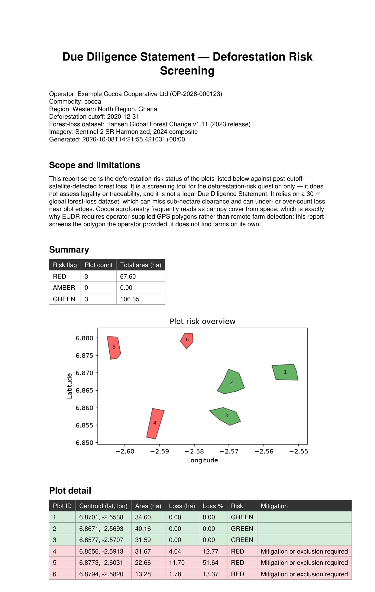

# EUDR Plot-Level Deforestation Screening (cocoa, Ghana)

Screens cocoa plots against post-2020 forest loss (Hansen Global Forest
Change) and produces a DDS-style PDF report per plot: risk flag, loss
area/percentage, and an explicit mitigation-or-exclusion flag for any RED
plot.

Built as a two-stage pipeline: Google Earth Engine does the geospatial
analysis, Python turns the exported results into a config-driven,
unit-tested report.



*Generated from the demo dataset in `data/` — 3 of 6 plots flagged RED for
post-2020 forest loss, each with a mitigation-or-exclusion notice.*

## How it works

1. **Earth Engine (`gee/eudr_screening.js`)** — for each operator-drawn
   plot polygon, sums Hansen `lossyear` pixels dated 2021 or later inside
   the boundary, and classifies the plot:
   - **RED** — post-2020 loss > 1% of plot area
   - **AMBER** — some loss detected, but at or below 1%
   - **GREEN** — no post-2020 loss detected

   Results are exported as `eudr_screening_results.csv` (one row per plot)
   and `eudr_plots.geojson` (same data plus geometry, for the report map).

2. **Python (`eudr_screening/`)** — reads both exports, re-derives each
   plot's risk flag from the thresholds in `config.yaml` (never trusting
   the raw CSV value blindly — any disagreement between source and
   recomputed flag is surfaced as a data-integrity warning), renders an
   overview map, and writes a per-plot PDF: operator reference, commodity,
   geolocation, area, post-2020 loss, risk flag, and — for every RED
   plot — an explicit "mitigation or exclusion required" notice.

The risk thresholds, cutoff date, commodity, operator reference, and
input/output paths are all config-driven (`config.yaml`), so the same
code works for any covered commodity (rubber, coffee, palm, ...) by
swapping the plot input — commodity is never hard-coded into the logic.

## Scope and limitations

1. This is a screening tool for the deforestation-risk question only.
2. It is **not** a legality or traceability check, and it is **not** a legal Due
Diligence Statement under EUDR.
3. It relies on a 30 m global dataset (Hansen
Global Forest Change), which misses sub-hectare clearance and can
mis-measure loss near plot edges. Cocoa agroforestry frequently reads as
canopy cover from space — this is exactly why **EUDR requires
operator-supplied GPS polygons** rather than remote farm detection: this
tool screens the polygon an operator provides, it does not find farms on
its own.

## Usage

1. Install dependencies: `pip install -e ".[dev]"`
2. Edit `config.yaml` with the operator's details, and confirm the risk
   thresholds and input paths.
3. Run: `python -m eudr_screening.cli --config config.yaml`
4. The PDF report is written to the path set in `output.report_path`
   (`output/eudr_dds_report.pdf` by default). The CLI also prints a
   per-flag plot/area summary and flags any source/recomputed mismatches.

The repo ships with a small demo dataset (`data/`) covering six plots in
Ghana's Western North cocoa belt, so the command above runs out of the
box without needing to run the Earth Engine step first.

## Project layout

```
eudr_screening/   risk classification, config loading, data joining,
                   map rendering, PDF report — one file per responsibility
gee/               Earth Engine script: site selection, loss detection,
                   per-plot risk classification, CSV/GeoJSON export
data/              demo screening exports (CSV + GeoJSON) used by default
tests/             unit tests + fixtures, one test module per package module
```

## Tests

```
pytest
```
